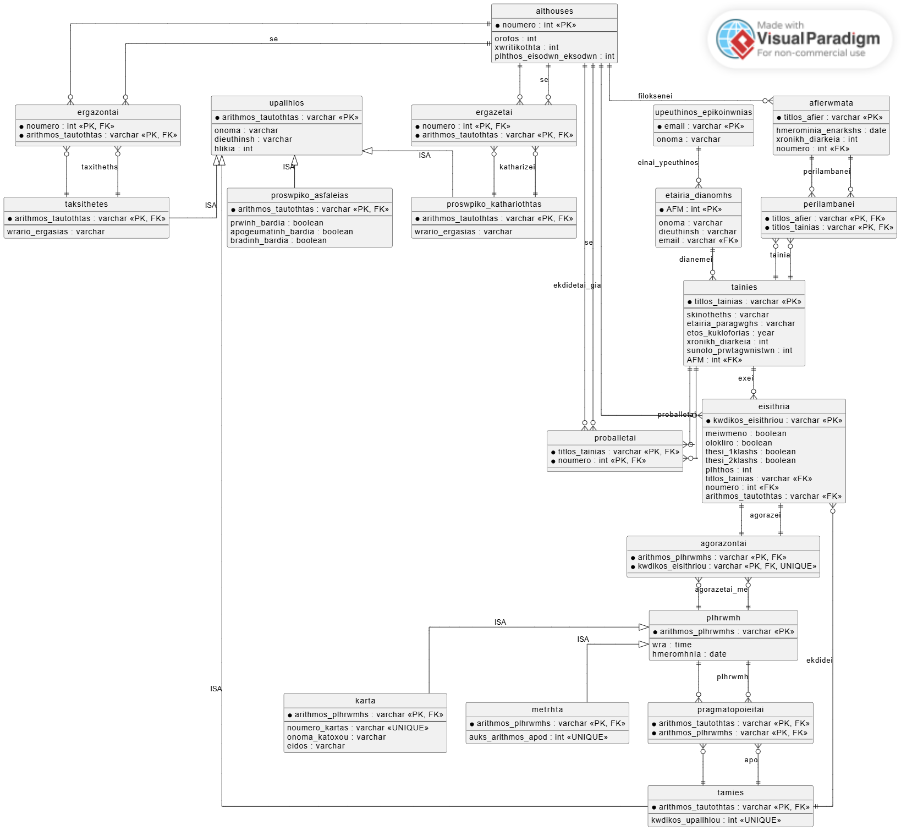

# Cinema Relational Database Management System

This project is a relational database system designed to manage the operations of a cinema.

It includes database design, implementation in SQL, sample data insertion, and analytical queries to extract useful insights from the system.

---

## Project Description

The system models a real-world cinema environment, including:

- Movies
- Cinema halls
- Tickets
- Employees (cashiers, cleaners, security staff, ushers)
- Payments (cash & card)
- Distribution companies
- Movie tributes/events

The project demonstrates how to transform an **Entity-Relationship (ER) model** into a **relational database schema**, while applying database normalization principles and SQL constraints.

It also demonstrates the use of:

- ISA specialization/generalization
- Many-to-many relationship modeling
- Composite primary keys
- Foreign key constraints
- Relational integrity rules

---

## Technologies Used

- SQL
- MySQL / MariaDB
- Relational Database Design
- ER Modeling

---

## Features

- Relational schema with normalization
- ER-to-relational mapping
- ISA specialization/generalization
- Many-to-many relationship handling
- SQL constraints (PK, FK, UNIQUE)
- Sample analytical SQL queries
- Data consistency enforcement
- Real-world cinema system modeling

---

## Database Structure

The database includes multiple interconnected tables such as:

- `tainies` (movies)
- `aithouses` (cinema halls)
- `eisithria` (tickets)
- `upallhlos` (employees)
- `tamies` (cashiers)
- `plhrwmh` (payments)
- `etairia_dianomhs` (distribution companies)
- `afierwmata` (movie tributes/events)

Relationships are enforced using:

- Primary Keys
- Foreign Keys
- Composite Keys
- UNIQUE Constraints

---

## ER Diagram



---

## How to Run

### 1. Create a new database

```sql
CREATE DATABASE cinema_db;
USE cinema_db;
```

### 2. Run the schema file
```sql
SOURCE path/to/schema.sql;
```

### 3. Insert sample data
```sql
SOURCE path/to/data.sql;
```

### 4. Run example queries
```sql
SOURCE path/to/queries.sql;
```

## Example Queries

This project includes SQL queries such as:

- Total tickets sold per movie
- Tickets sold per cinema hall
- Movies projected in each hall
- Number of payments processed by each cashier
- Employees working in each hall
- Payment method statistics
- Distribution companies associated with movies
- Tribute events and included movies

## Database Concepts Demonstrated

The project demonstrates important database concepts including:

- Entity-Relationship (ER) modeling
- Relational schema design
- Primary and foreign keys
- ISA specialization/generalization
- Many-to-many relationships
- Data normalization
- Composite primary keys
- SQL joins and aggregations
- Referential integrity

## Future Improvements

Possible future improvements include:

- Adding a backend application (Python / Node.js)
- Creating a simple web interface
- Building a dashboard for data visualization
- Adding indexing and query optimization techniques
- Implementing user authentication
- Developing a cinema reservation system
     
## Author

Eirini Markantoni


